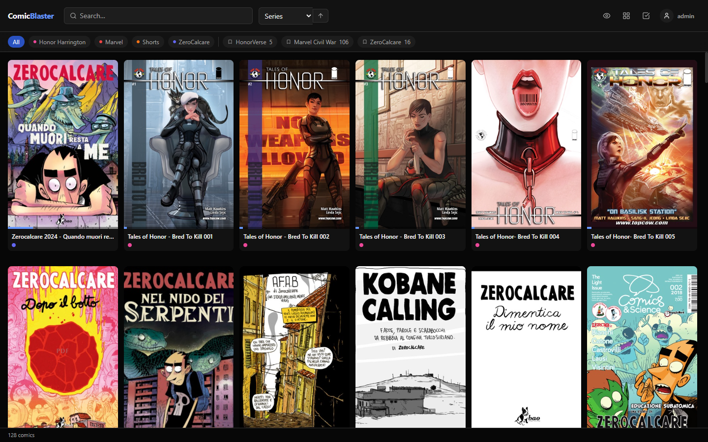
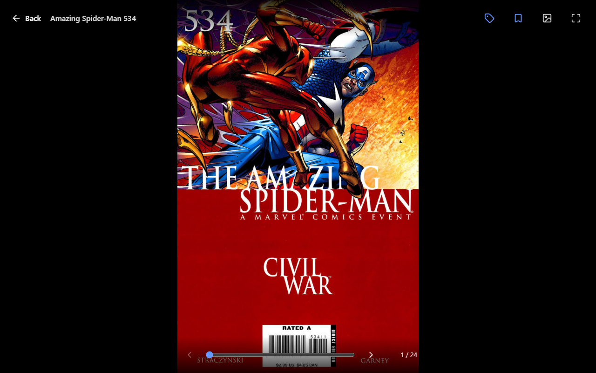
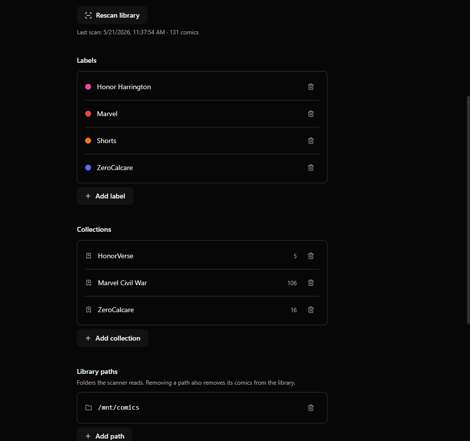
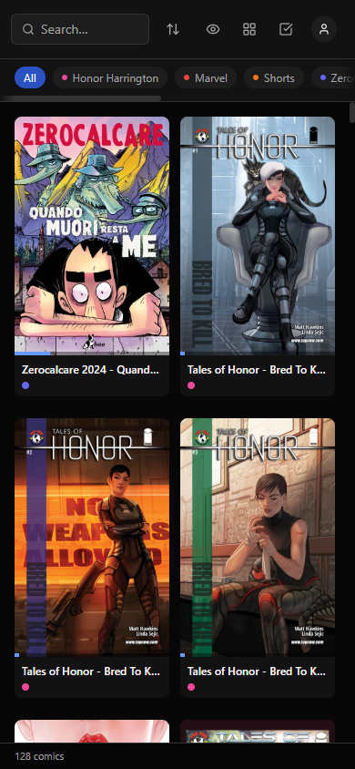

# ComicBlaster

A self-hosted comic, manga, and ePub reader. Single Go binary on the back end,
React on the front end. Runs comfortably on a Raspberry Pi 5 or any small
home server. Designed to read your library off a NAS/SMB mount or a local
folder — no uploads required.

<p align="center">
  
</p>

## Features

- **Formats**: CBZ / ZIP, CBR (pure-Go RAR decoder), PDF (rendered client-side
  with pdf.js), ePub (rendered client-side with epub.js, with theme + font
  controls and CFI-based progress tracking)
- **Multi-user** with admin / regular roles; per-user reading progress,
  labels, and collections
- **Smart library**: title / series detection, ComicInfo.xml metadata,
  cover extraction, customisable thumbnails (server-extracted for archives,
  canvas-captured for PDFs / ePubs)
- **Library management**: paths and ignore list managed from Settings (no
  need to edit config.yaml), per-comic hide-or-delete confirmation
- **Powerful selection**: cmd/ctrl-click + shift-click ranges on desktop, a
  Select button on touch; bulk apply labels, add to collections, hide; new
  labels and collections can be created and applied from the bulk bar in one
  step
- **Two library views**: classic grid and a Collections view where each
  collection collapses into a single mosaic-cover card
- **Reader UX**: pinch / wheel / double-tap zoom, axis-locked horizontal
  swipes (no vertical drift), horizontal trackpad scroll → page nav, ePub
  reflow with light/sepia/dark themes and 8-step font sizing
- **Mobile-aware**: safe-area padding on bottom bars, touch-targeted icon
  buttons, hover-and-touch parity for card actions
- **Auto-update**: optional systemd timer / Windows scheduled task that
  pulls + rebuilds + restarts daily

## Quick start

### Linux / Raspberry Pi OS

```bash
git clone https://github.com/Gman0909/ComicBlaster.git
cd ComicBlaster
./scripts/install.sh
```

The installer will check for Go / Node / git, build the server and web
client, write a default config to `~/comicblaster-data/config.yaml`, and
optionally register a `comicblaster.service` systemd unit running as your
current user. It will also offer to enable a nightly auto-update timer.

When done, open <http://localhost:8082> and create the first (admin) user.

### Windows

From an unrestricted PowerShell prompt:

```powershell
git clone https://github.com/Gman0909/ComicBlaster.git
cd ComicBlaster
.\scripts\install.ps1
```

Or double-click `scripts\install.bat` — that runs the same script with
the right execution policy.

The installer builds the binary, writes `%USERPROFILE%\comicblaster-data\config.yaml`,
and optionally registers a `ComicBlaster` scheduled task that launches at
logon plus a daily auto-update task.

Requires: [Go](https://go.dev/dl/), [Node.js LTS](https://nodejs.org/),
and [Git](https://git-scm.com/) on PATH.

## First run

When you open ComicBlaster for the first time, the sign-in page detects
that no users exist and automatically switches to setup mode (the heading
reads *"Create your admin account to get started"*).

1. Fill in a username, an optional email, and a password.
2. Click **Create account**.

The first user you create is the admin. You'll be signed in immediately
and dropped on the (empty) library. To start using it:

1. Open the **profile menu** in the top-right and click **Settings**.
2. Under **Library paths**, click **Add path** and point it at the folder
   on the server that holds your comics (a local directory, an SMB / NFS
   mount, whatever). You can add as many paths as you like.
3. Open the profile menu again and click **Rescan library** — or wait;
   the scanner also runs every 5 minutes (`scan_interval` in
   `config.yaml`).

Subsequent visits show a normal sign-in form. The first user's
credentials are stored in the SQLite database under your data
directory — there's no separate config file for them.

### Creating additional users

Only admins see the user-management area.

1. Open **Settings** from the profile menu (top-right).
2. Scroll to the **Users** section near the bottom.
3. Click **Add user**.
4. Fill in username, optional email, and password, then pick **User** or
   **Admin** from the role dropdown.
5. Click **Create**.

Regular users get their own per-user reading progress, labels, and
collections, but they share the same library of comics. Admins
additionally see Library paths, Ignored items, and the Users list.

To reset a user's password, click **Reset pw** next to their name in the
Users list. To remove a user, click the trash icon (you can't delete
yourself — sign in as another admin first). Deleting a user removes
their progress, labels, and collections; the comics themselves are
untouched.

## Configuration

`~/comicblaster-data/config.yaml` (or `%USERPROFILE%\comicblaster-data\config.yaml`)
holds:

```yaml
server:
  http_port: 8082            # HTTP port to listen on
  web_root: /path/to/web/dist  # location of the built web client
library:
  paths: []                  # managed through Settings → Library paths
  scan_interval: 300         # seconds between automatic library rescans
data_dir: /path/to/data      # absolute path to the data directory
```

Most users won't need to touch this — the installer writes a working file
and the rest is configured through the **Settings** page in the web UI:

- **Library paths** (admin) — folders the scanner reads
- **Ignored items** (admin) — re-add comics you previously hid
- **Labels** — per-user tags shown as colored chips on cards
- **Collections** — per-user ordered groupings (saved reading lists)
- **Users** (admin) — create accounts, reset passwords

## Updating

After the initial install, either:

- run `./scripts/update.sh` (Linux) or `scripts\update.ps1` (Windows) by hand
- or let the auto-update timer / scheduled task do it nightly (enabled
  during install)

Both methods are `git pull` + rebuild + restart. The data directory and DB
are never touched by an update.

## Development

The server is plain Go 1.22 + `modernc.org/sqlite` (pure-Go, no CGo) under
`server/`. The web client is Vite + React 19 + Tailwind 4 under `web/`.

```bash
# server
cd server
go run ./cmd/comicblaster -config /path/to/config.yaml

# web (in another terminal)
cd web
npm install
npm run dev
# Optional: point Vite's dev proxy at a remote server
CB_API_TARGET=http://192.168.1.50:8082 npm run dev
```

The Vite dev server proxies `/api` to the Go server (defaults to
`http://localhost:8082`).

## Data dir layout

Everything stateful lives in the data dir — back this up to preserve your
library state, progress, and accounts:

```
comicblaster-data/
├── comicblaster.db    # SQLite database (users, comics, labels, …)
├── config.yaml        # configuration
├── covers/            # extracted comic covers (300px JPEG)
└── secret.key         # persistent JWT signing key
```

## Screenshots

<table>
  <tr>
    <td width="50%" valign="top">
      <a href="docs/screenshots/reader-desktop.png">
        
      </a>
      <p><strong>Reader</strong> — same chrome and gestures for CBZ, CBR, and PDF. Slider scrubs the full book; pinch / wheel / double-tap zooms; horizontal trackpad swipe pages.</p>
    </td>
    <td width="50%" valign="top">
      <a href="docs/screenshots/settings-desktop.png">
        
      </a>
      <p><strong>Settings</strong> — labels, collections, library paths and admin user management all live here. No need to hand-edit <code>config.yaml</code> after the first run.</p>
    </td>
  </tr>
  <tr>
    <td width="50%" valign="top">
      <a href="docs/screenshots/library-mobile.png">
        
      </a>
      <p><strong>Mobile library</strong> — responsive grid; sort collapses to an icon-triggered popover so the search box stays usable on a phone.</p>
    </td>
    <td width="50%" valign="top">
      <a href="docs/screenshots/library-desktop.png">
        
      </a>
      <p><strong>Library</strong> — sortable, filterable by labels and collections, unread-only toggle, per-user progress shown as a thin blue bar across each cover.</p>
    </td>
  </tr>
</table>

## License

MIT — see [LICENSE](LICENSE).
